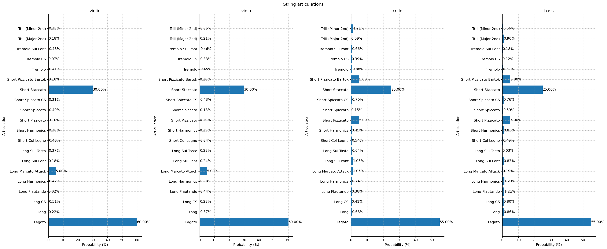
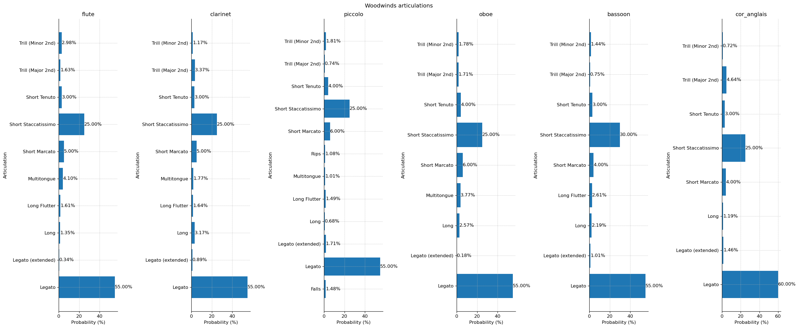
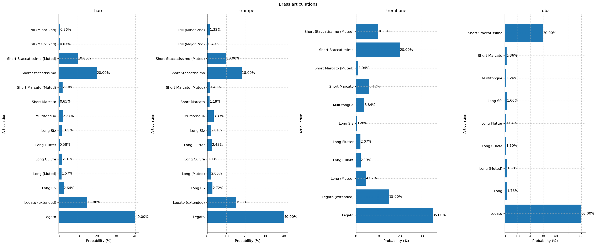
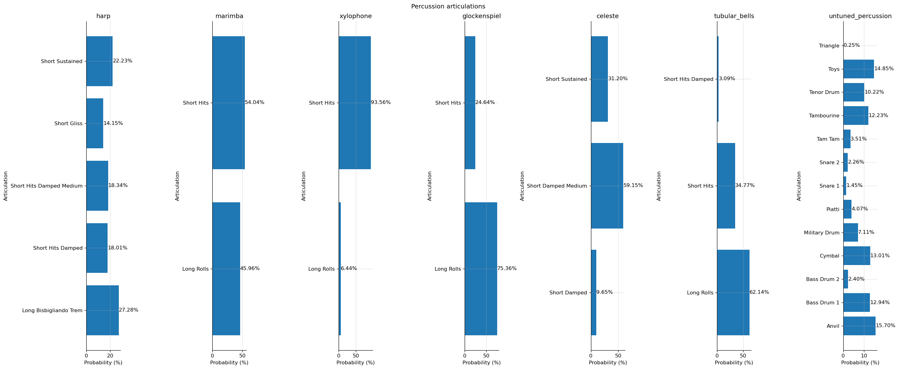

# HQ-SOD-generator

This software prepare and generate High Quality sounds to train AI-based music instrument source separation approaches based on the Symbolic Orchestral Database (SOD), which can be downloaded here: https://qsdfo.github.io/LOP/database.html.

The tool recursively processes MIDI files within a directory and automates the synthesis process through the REAPER DAW.

It also includes support for percussion instrument mapping according to the MIDI pitch ranges of the different percussive instruments of the [Spitfire's BBC Symphony Orchestra Professional sound fonts](https://www.spitfireaudio.com/bbc-symphony-orchestra-professional).

The code for training the baseline and pretrained models is available at https://github.com/repertorium/SynthSOD-Baseline, using the synthesized dataset, which can be downloaded from Zenodo: https://doi.org/10.5281/zenodo.13759492.

## Features

- Generates diverse and representative orchestral music conditions for AI training: This tool processes MIDI files by introducing variations that mimic realistic orchestral performance.
  - Tempo Randomization: Randomizes tempo intervals to simulate natural tempo fluctuations in orchestral music.
  - Dynamic Randomization: Randomizes dynamic changes (e.g., volume or intensity) to reflect the varying loudness levels in an orchestra.
  - Articulation Randomization: Applies random articulations (e.g., staccato, legato) to individual MIDI tracks to imitate different playing techniques used by musicians.

- REAPER Integration: Automates MIDI file synthesis using the REAPER DAW via Python API.
  
- Percussion Mapping: Supports mapping MIDI pitch notes to percussion instruments.

## Usage

The main functionality of the repository is accessed through the [main.py](./main.py) script, which provides a CLI interface to randomize the tempo, dynamics, and articulations in MIDI files located in the specified `source_directory`. The processed MIDI files will be written to the `output_directory`.

```bash
python main.py --source <source_directory> --destination <output_directory>
```
## Configuration

Articulations are represented based on the MIDI CC#32 message values. Each articulation has a set probability for different instruments available in the BBCSO Professional sound fonts. You can modify the probability of occurrence for each articulation by editing the [articulations.yaml](./articulations.yaml) file.

The following figures present the default probability of occurrence for each instrument within the dataset, categorized by their respective instrument families: strings, woodwinds, brass, and percussion. In each figure, the y-axis represents the instruments within the respective family, while the x-axis denotes their probability of occurrence as a proportion of the dataset.









## Submodules

The Reaper subdirectory contains tools that automate the synthesis of randomized MIDI files using REAPER. This helps generate audio data in bulk for training AI models in sound source separation. For detailed instructions, refer to the Reaper README.

The PercussionPitchMapping folder provides tools to map MIDI pitch notes to percussion instruments. More details can be found in the Percussion Mapping README.
